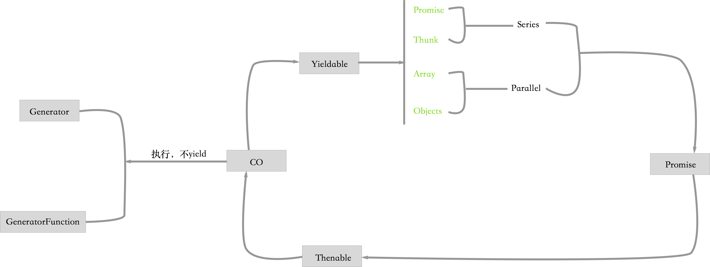

# yieldable


The co [yieldable](https://github.com/tj/co/#yieldables) objects currently supported are:

* [x] promises
* [x] thunks (functions)
* [x] array (parallel execution)
* [x] objects (parallel execution)
- generators (delegation)
- generator functions (delegation)

Nested `yieldable` objects are supported, meaning you can nest promises within objects within arrays, and so on!




## generator

http://wiki.ecmascript.org/doku.php?id=harmony:generators


## co-express


- https://github.com/mciparelli/co-express


```
var co = require('co');

module.exports = function wrap(gen) {
  var fn = co.wrap(gen);

  if (gen.length === 4) {
    return function(err, req, res, next) {
      return fn(err, req, res, next).catch(next);
    }
  }

  return function(req, res, next) {
    return fn(req, res, next).catch(next);
  };
};
```

## 参考

- http://tobyho.com/2015/12/27/promise-based-coroutines-nodejs/
- https://github.com/airportyh/coroutines-in-node